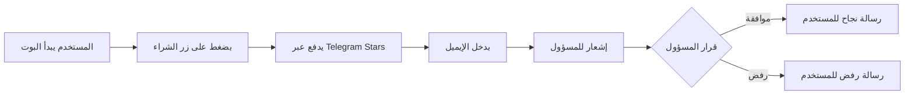

<div align="center">

# 🤖 بوت تيليجرام لبيع المنتجات الرقمية

### 💎 بيع المنتجات الرقمية بسهولة وأمان عبر Telegram Stars

[](https://nodejs.org/)
[](https://telegraf.js.org/)
[](https://supabase.com/)
[](LICENSE)

**نظام متكامل لبيع الاشتراكات والمنتجات الرقمية بأسعار تنافسية**

[المميزات](#-المميزات) • [التثبيت](#-التثبيت) • [الاستخدام](#-الاستخدام) • [البنية](#-البنية)

---

</div>

## 📋 نظرة عامة

بوت تيليجرام احترافي لبيع المنتجات الرقمية (مثل اشتراكات ChatGPT وغيرها) عبر نظام دفع آمن باستخدام **Telegram Stars**. يوفر تجربة سلسة للمستخدمين وإدارة سهلة للمسؤولين.

### ✨ لماذا هذا البوت؟

- 💰 **أسعار تنافسية** - بيع المنتجات بأسعار أقل من الأسواق التقليدية
- 🔒 **دفع آمن** - استخدام Telegram Stars المدمج في تيليجرام
- ⚡ **سهولة الاستخدام** - واجهة بسيطة وسريعة
- 📊 **إدارة متكاملة** - نظام موافقة/رفض للطلبات
- 🚀 **جاهز للنشر** - يعمل على Render وغيره من المنصات

---

## 🌟 المميزات

### للمستخدمين 👥
- ✅ واجهة سهلة ومباشرة
- ✅ دفع آمن عبر Telegram Stars
- ✅ إشعارات فورية عن حالة الطلب
- ✅ لا حاجة لحسابات خارجية

### للمسؤولين 👨‍💼
- ✅ لوحة تحكم بسيطة عبر تيليجرام
- ✅ إشعارات فورية لكل طلب جديد
- ✅ نظام موافقة/رفض سريع
- ✅ تخزين آمن للبيانات في Supabase
- ✅ سجل كامل للطلبات والمدفوعات

### تقنية 🔧
- ✅ دعم Webhook و Polling
- ✅ معالجة أخطاء متقدمة
- ✅ سجلات تفصيلية
- ✅ جاهز للإنتاج

---

## 🚀 التثبيت

### المتطلبات الأساسية

- [Node.js](https://nodejs.org/) 16 أو أحدث
- حساب [Telegram Bot](https://t.me/BotFather)
- حساب [Supabase](https://supabase.com)
- حساب [Render](https://render.com) (للنشر)

---

### خطوة 1️⃣: استنساخ المشروع

```bash
git clone <repository-url>
cd telegram-subscription-bot
npm install
```

---

### خطوة 2️⃣: إعداد متغيرات البيئة

انسخ ملف `.env.example` إلى `.env`:

```bash
cp env.example .env
```

عدّل ملف `.env` وأضف القيم التالية:

```env
# Telegram Bot Configuration
BOT_TOKEN=your_bot_token_here
FOUNDER_ID=your_telegram_user_id_here

# Supabase Configuration
SUPABASE_URL=your_supabase_project_url
SUPABASE_KEY=your_supabase_anon_key

# Server Configuration
PORT=3000
WEBHOOK_URL=https://your-app-name.onrender.com

# Payment Configuration
PAYMENT_AMOUNT=1
PAYMENT_CURRENCY=XTR
```

---

### خطوة 3️⃣: الحصول على Bot Token

1. اذهب إلى [@BotFather](https://t.me/BotFather) على تيليجرام
2. أرسل `/newbot` واتبع التعليمات
3. احفظ الـ **Token** الذي يعطيك إياه
4. ضعه في `BOT_TOKEN` في ملف `.env`

---

### خطوة 4️⃣: معرفة Founder ID

1. اذهب إلى [@userinfobot](https://t.me/userinfobot) على تيليجرام
2. أرسل `/start`
3. احفظ الـ **ID** الذي يعطيك إياه
4. ضعه في `FOUNDER_ID` في ملف `.env`

---

### خطوة 5️⃣: إعداد Supabase

#### 5.1 إنشاء المشروع
1. أنشئ حساب على [Supabase](https://supabase.com)
2. أنشئ مشروع جديد
3. انتظر حتى يكتمل الإعداد

#### 5.2 إعداد قاعدة البيانات
1. اذهب إلى **SQL Editor** في Supabase
2. افتح ملف `database.sql` من المشروع
3. انسخ المحتوى كاملاً
4. الصقه في SQL Editor
5. اضغط **Run** لتنفيذ الكود

#### 5.3 الحصول على API Keys
1. اذهب إلى **Settings** > **API**
2. انسخ **Project URL** وضعها في `SUPABASE_URL`
3. انسخ **anon/public key** وضعها في `SUPABASE_KEY`

---

### خطوة 6️⃣: التشغيل المحلي

```bash
# للتشغيل العادي
npm start

# للتطوير مع إعادة التشغيل التلقائي
npm run dev
```

---

## 📦 النشر على Render

### 1. إنشاء حساب Render
- اذهب إلى [Render](https://render.com)
- سجّل حساب جديد (يمكن استخدام GitHub)

### 2. إنشاء Web Service
1. اضغط **New** > **Web Service**
2. وصّل GitHub repository
3. املأ الإعدادات:
   - **Name**: اختر اسماً للمشروع
   - **Environment**: `Node`
   - **Build Command**: `npm install`
   - **Start Command**: `node index.js`
   - **Plan**: اختر الخطة المناسبة

### 3. إضافة Environment Variables
في قسم **Environment Variables**، أضف جميع المتغيرات من ملف `.env`:
- `BOT_TOKEN`
- `FOUNDER_ID`
- `SUPABASE_URL`
- `SUPABASE_KEY`
- `PORT` (اختياري، افتراضي: 3000)
- `WEBHOOK_URL` (سيتم ملؤه بعد النشر)
- `PAYMENT_AMOUNT`
- `PAYMENT_CURRENCY`

### 4. الحصول على Webhook URL
1. بعد النشر، Render سيعطيك URL مثل: `https://your-app.onrender.com`
2. انسخ هذا الـ URL
3. أضفه في Environment Variables كـ `WEBHOOK_URL`
4. أعد نشر المشروع

---

## 💻 الاستخدام

### للمستخدمين

1. **ابدأ البوت**
   ```
   /start
   ```

2. **اضغط على زر "🛒 الحصول على الباقات"**

3. **ادفع عبر Telegram Stars**
   - سيظهر لك فاتورة الدفع
   - اضغط **Pay** وادفع باستخدام Stars

4. **أدخل الإيميل**
   - بعد الدفع الناجح، سيطلب البوت الإيميل
   - أدخل الإيميل المطلوب

5. **انتظر الموافقة**
   - سيتم إرسال إشعار للمسؤول
   - بعد الموافقة، ستصلك رسالة التفعيل

### للمسؤولين

عند وصول طلب جديد، ستصلك رسالة تحتوي على:
- معلومات المستخدم
- الإيميل المدخل
- مبلغ الدفع
- رقم الطلب

**الخيارات المتاحة:**
- ✅ **تم إنهاء العملية** - للموافقة على الطلب
- ❌ **مرفوض** - لرفض الطلب

---

## 📁 البنية

```
telegram-subscription-bot/
├── 📄 index.js              # Express server و webhook handler
├── 🤖 bot.js                # منطق البوت الرئيسي
├── 🗄️  supabase.js           # الاتصال بـ Supabase
├── 📊 database.sql           # مخطط قاعدة البيانات
├── 📦 package.json           # التبعيات والإعدادات
├── 🔐 env.example            # مثال لمتغيرات البيئة
└── 📖 README.md             # هذا الملف
```

---

## 🔄 سير العمل



---

## 🗄️ قاعدة البيانات

### جدول `subscriptions`

| العمود | النوع | الوصف |
|--------|-------|-------|
| `id` | BIGSERIAL | المعرف الفريد (Primary Key) |
| `user_id` | BIGINT | معرف المستخدم في تيليجرام |
| `username` | VARCHAR(255) | اسم المستخدم |
| `email` | VARCHAR(255) | الإيميل (يمكن أن يكون NULL) |
| `status` | VARCHAR(50) | الحالة: pending, approved, rejected |
| `payment_amount` | INTEGER | مبلغ الدفع |
| `payment_currency` | VARCHAR(10) | عملة الدفع (XTR) |
| `created_at` | TIMESTAMP | تاريخ الإنشاء |
| `updated_at` | TIMESTAMP | تاريخ آخر تحديث |

---

## 🔐 الأمان

- ⚠️ **لا تشارك ملف `.env`** أو ترفعه إلى Git
- ⚠️ **احمِ API keys** الخاصة بك
- ⚠️ **استخدم HTTPS فقط** في الإنتاج
- ⚠️ **راجع الطلبات** قبل الموافقة عليها

---

## 🛠️ التطوير

### إضافة منتجات جديدة

لتعديل المنتجات المعروضة، عدّل في `bot.js`:

```javascript
const invoice = {
  title: 'اسم المنتج',
  description: 'وصف المنتج',
  // ...
};
```

### تعديل مبلغ الدفع

عدّل في ملف `.env`:
```env
PAYMENT_AMOUNT=1
```

---

## 🐛 استكشاف الأخطاء

### البوت لا يعمل
- ✅ تأكد من صحة `BOT_TOKEN`
- ✅ تأكد من الاتصال بالإنترنت
- ✅ تأكد من تفعيل البوت من @BotFather

### قاعدة البيانات لا تعمل
- ✅ تأكد من صحة `SUPABASE_URL` و `SUPABASE_KEY`
- ✅ تأكد من تنفيذ `database.sql` في Supabase
- ✅ تحقق من صلاحيات API Key

### Webhook لا يعمل
- ✅ تأكد من صحة `WEBHOOK_URL`
- ✅ تأكد من أن السيرفر يعمل على Render
- ✅ تحقق من السجلات في Render Dashboard

---

## 📝 الترخيص

هذا المشروع مرخص تحت [MIT License](LICENSE).

---

## 🤝 المساهمة

نرحب بمساهماتكم! يرجى:
1. Fork المشروع
2. إنشاء branch جديد (`git checkout -b feature/AmazingFeature`)
3. Commit التغييرات (`git commit -m 'Add some AmazingFeature'`)
4. Push إلى Branch (`git push origin feature/AmazingFeature`)
5. فتح Pull Request

---

## 📞 الدعم

للمساعدة أو الإبلاغ عن مشاكل:
- افتح [Issue](https://github.com/your-repo/issues) في المستودع
- أو راسلنا على تيليجرام

---

## ⭐ شكر خاص

شكراً لاستخدامك هذا البوت! إذا أعجبك المشروع، لا تنسى ⭐ Star!

---

<div align="center">

**صُنع بـ ❤️ للمجتمع العربي**

[⬆ العودة للأعلى](#-بوت-تيليجرام-لبيع-المنتجات-الرقمية)

</div>

